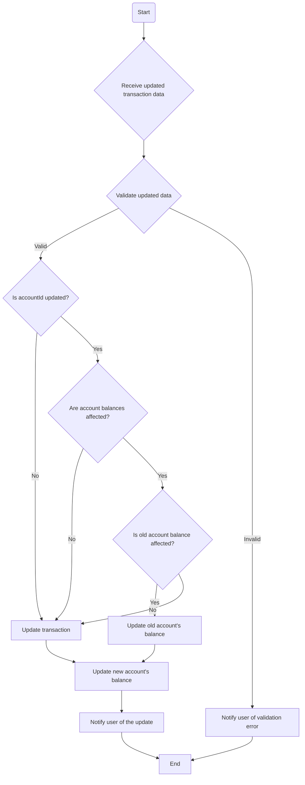

## Update Transaction Flow

```mermaid
graph TD;
    Start(Start) --> Input{Receive updated transaction data};
    Input --> Validate{Validate updated data};
    Validate -- Valid --> CheckAccountId;
    Validate -- Invalid --> NotifyError[Notify user of validation error];
    CheckAccountId{Is accountId updated?};
    CheckAccountId -- No --> UpdateTransaction[Update transaction];
    CheckAccountId -- Yes --> CheckAccountBalances{Are account balances affected?};
    CheckAccountBalances -- No --> UpdateTransaction[Update transaction];
    CheckAccountBalances -- Yes --> CheckOldAccountBalance{Is old account balance affected?};
    CheckOldAccountBalance -- Yes --> UpdateOldAccount[Update old account's balance];
    CheckOldAccountBalance -- No --> UpdateTransaction[Update transaction];
    UpdateOldAccount --> UpdateNewAccount[Update new account's balance];
    UpdateTransaction --> UpdateNewAccount[Update new account's balance];
    UpdateNewAccount --> NotifySucess[Notify user of the update]
    NotifyError --> End[End];
    NotifySucess --> End[End]
```
